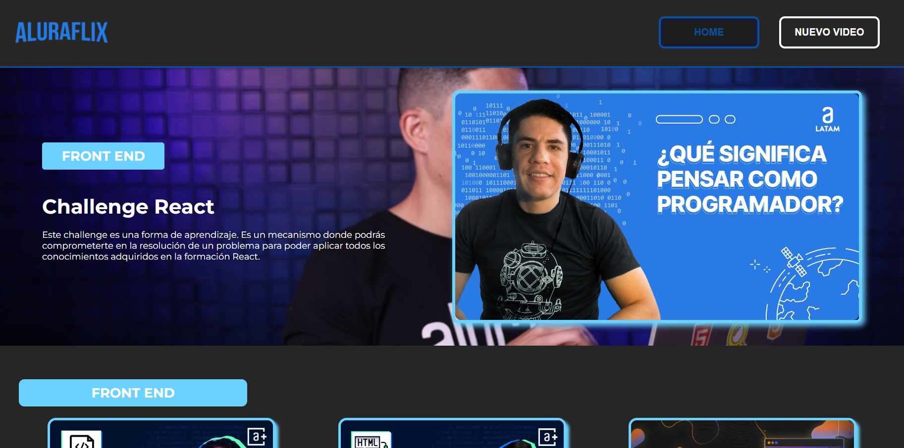

# ALURAFLIX

Aluraflix es una plataforma desarrollada como parte del programa de especialización en front end de ONE (Oracle Next Education). Este proyecto tiene como objetivo principal permitir a los usuarios listar, registrar, eliminar y actualizar vídeos. A través de la construcción de Aluraflix, se pondrán en práctica todos los conocimientos adquiridos sobre React y otros aspectos relevantes del desarrollo front end.

## Características

- **Listar Vídeos:** Los usuarios pueden ver una lista de vídeos organizados por categorías.
- **Registrar Vídeos:** Los usuarios pueden agregar nuevos vídeos con detalles como título, imagen, y categoría.
- **Eliminar Vídeos:** Los usuarios pueden eliminar vídeos existentes.
- **Actualizar Vídeos:** Los usuarios pueden editar los detalles de los vídeos existentes.

## Tecnologías Utilizadas

- **React:** Biblioteca principal para construir la interfaz de usuario.
- **Vite:** Herramienta de construcción rápida para el desarrollo de aplicaciones de React.
- **CSS Modules:** Para el manejo de estilos de componentes de manera modular y evitar conflictos de nombres.
- **SweetAlert2:** Para mostrar alertas y diálogos atractivos y personalizables.
- **Axios:** Para realizar peticiones HTTP.
- **React Router DOM:** Para el manejo de rutas en la aplicación.
